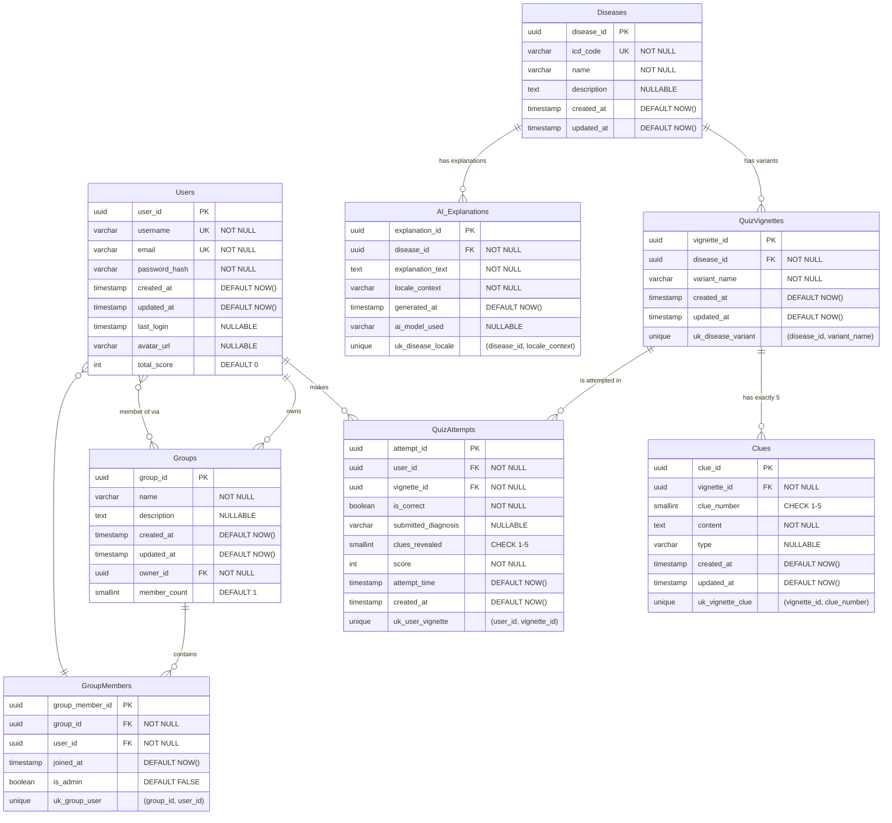

# ClinIQ-AI - Entity Relationship Diagram (ERD) Proposal

## Visual ERD (Mermaid)

---

## Entities & Attributes

### 1. Users
- `user_id` (PK, UUID)
- `username` (VARCHAR, Unique, NOT NULL)
- `email` (VARCHAR, Unique, NOT NULL)
- `password_hash` (VARCHAR, NOT NULL)
- `created_at` (TIMESTAMP, DEFAULT NOW())
- `updated_at` (TIMESTAMP, DEFAULT NOW())
- `last_login` (TIMESTAMP, NULLABLE)
- `avatar_url` (VARCHAR, NULLABLE)
- `total_score` (INT, DEFAULT 0) — *Cached, Redis is source of truth for leaderboards*

### 2. Diseases
- `disease_id` (PK, UUID)
- `icd_code` (VARCHAR, Unique, NOT NULL)
- `name` (VARCHAR, NOT NULL)
- `description` (TEXT, NULLABLE)
- `created_at` (TIMESTAMP, DEFAULT NOW())
- `updated_at` (TIMESTAMP, DEFAULT NOW())

### 3. QuizVignettes (Clinical Cases)
- `vignette_id` (PK, UUID)
- `disease_id` (FK to Diseases.disease_id, NOT NULL)
- `variant_name` (VARCHAR, NOT NULL) — *e.g., "Classic Presentation", "Pediatric Case"*
- `created_at` (TIMESTAMP, DEFAULT NOW())
- `updated_at` (TIMESTAMP, DEFAULT NOW())
- **Unique Constraint:** `(disease_id, variant_name)`

### 4. Clues
- `clue_id` (PK, UUID)
- `vignette_id` (FK to QuizVignettes.vignette_id, NOT NULL)
- `clue_number` (SMALLINT, NOT NULL, CHECK (clue_number BETWEEN 1 AND 5))
- `content` (TEXT, NOT NULL)
- `type` (VARCHAR, NULLABLE) — *e.g., 'demographic', 'anamnesis', 'lab_result', 'epidemiology'*
- `created_at` (TIMESTAMP, DEFAULT NOW())
- `updated_at` (TIMESTAMP, DEFAULT NOW())
- **Unique Constraint:** `(vignette_id, clue_number)`

### 5. QuizAttempts
- `attempt_id` (PK, UUID)
- `user_id` (FK to Users.user_id, NOT NULL)
- `vignette_id` (FK to QuizVignettes.vignette_id, NOT NULL)
- `is_correct` (BOOLEAN, NOT NULL)
- `submitted_diagnosis` (VARCHAR, NULLABLE)
- `clues_revealed` (SMALLINT, NOT NULL, CHECK (clues_revealed BETWEEN 1 AND 5))
- `score` (INT, NOT NULL) — *Calculated based on `clues_revealed`*
- `attempt_time` (TIMESTAMP, DEFAULT NOW())
- `created_at` (TIMESTAMP, DEFAULT NOW())
- **Unique Constraint:** `(user_id, vignette_id)` — enforces one-attempt-per-vignette

### 6. AI_Explanations
- `explanation_id` (PK, UUID)
- `disease_id` (FK to Diseases.disease_id, NOT NULL)
- `explanation_text` (TEXT, NOT NULL)
- `locale_context` (VARCHAR, NOT NULL) — *e.g., "INDONESIA_GENERAL", "INDONESIA_JAJAN"*
- `generated_at` (TIMESTAMP, DEFAULT NOW())
- `ai_model_used` (VARCHAR, NULLABLE)
- **Unique Constraint:** `(disease_id, locale_context)`

### 7. Groups
- `group_id` (PK, UUID)
- `name` (VARCHAR, NOT NULL)
- `description` (TEXT, NULLABLE)
- `created_at` (TIMESTAMP, DEFAULT NOW())
- `updated_at` (TIMESTAMP, DEFAULT NOW())
- `owner_id` (FK to Users.user_id, NOT NULL)
- `member_count` (SMALLINT, DEFAULT 1) — *Cached for quick checks, enforced max 5*

### 8. GroupMembers
- `group_member_id` (PK, UUID)
- `group_id` (FK to Groups.group_id, NOT NULL)
- `user_id` (FK to Users.user_id, NOT NULL)
- `joined_at` (TIMESTAMP, DEFAULT NOW())
- `is_admin` (BOOLEAN, DEFAULT FALSE)
- **Unique Constraint:** `(group_id, user_id)`

---

## Foreign Key Actions (Cascade Behavior)

| FK | Parent | Child | ON DELETE | ON UPDATE |
|----|--------|-------|-----------|-----------|
| `QuizVignettes.disease_id` | `Diseases.disease_id` | `QuizVignettes` | CASCADE | CASCADE |
| `Clues.vignette_id` | `QuizVignettes.vignette_id` | `Clues` | CASCADE | CASCADE |
| `QuizAttempts.user_id` | `Users.user_id` | `QuizAttempts` | CASCADE | CASCADE |
| `QuizAttempts.vignette_id` | `QuizVignettes.vignette_id` | `QuizAttempts` | RESTRICT | CASCADE |
| `AI_Explanations.disease_id` | `Diseases.disease_id` | `AI_Explanations` | CASCADE | CASCADE |
| `Groups.owner_id` | `Users.user_id` | `Groups` | RESTRICT | CASCADE |
| `GroupMembers.group_id` | `Groups.group_id` | `GroupMembers` | CASCADE | CASCADE |
| `GroupMembers.user_id` | `Users.user_id` | `GroupMembers` | CASCADE | CASCADE |

**Rationale:**
- **CASCADE** on child tables that naturally belong to the parent (Clues → Vignettes, GroupMembers → Groups). Removing the parent removes the children.
- **RESTRICT** on `QuizAttempts.vignette_id` — prevents deleting a vignette that has existing attempts (historical integrity).
- **RESTRICT** on `Groups.owner_id` — cannot delete a user who still owns groups; must transfer ownership first.
- **CASCADE** on others — if a disease or user is removed, its cached explanations and attempts are safe to remove too.

---

## Relationships

- `Users` `1` — `M` `QuizAttempts`
- `Users` `1` — `M` `Groups` (as owner)
- `Users` `M` — `M` `Groups` (via `GroupMembers` join table)
- `Diseases` `1` — `M` `QuizVignettes`
- `Diseases` `1` — `M` `AI_Explanations`
- `QuizVignettes` `1` — `5` `Clues` (exactly 5 clues per vignette)
- `QuizVignettes` `1` — `M` `QuizAttempts`

---

## Indexes (Proposed)

| Index Name | Table | Column(s) | Type |
|------------|-------|-----------|------|
| `idx_users_email` | Users | email | UNIQUE |
| `idx_users_username` | Users | username | UNIQUE |
| `idx_diseases_icd_code` | Diseases | icd_code | UNIQUE |
| `idx_diseases_name_trgm` | Diseases | name | GIN (pg_trgm) |
| `idx_vignettes_disease_id` | QuizVignettes | disease_id | BTREE |
| `idx_vignettes_disease_variant` | QuizVignettes | (disease_id, variant_name) | UNIQUE BTREE |
| `idx_clues_vignette_id` | Clues | vignette_id | BTREE |
| `idx_clues_vignette_clue_num` | Clues | (vignette_id, clue_number) | UNIQUE BTREE |
| `idx_quizattempts_user_id` | QuizAttempts | user_id | BTREE |
| `idx_quizattempts_vignette_id` | QuizAttempts | vignette_id | BTREE |
| `idx_quizattempts_user_vignette` | QuizAttempts | (user_id, vignette_id) | UNIQUE BTREE |
| `idx_aiexplanations_disease_locale` | AI_Explanations | (disease_id, locale_context) | UNIQUE BTREE |
| `idx_groups_owner_id` | Groups | owner_id | BTREE |
| `idx_groupmembers_group_id` | GroupMembers | group_id | BTREE |
| `idx_groupmembers_user_id` | GroupMembers | user_id | BTREE |
| `idx_groupmembers_group_user` | GroupMembers | (group_id, user_id) | UNIQUE BTREE |

---

## Redis Usage

- **Global Leaderboard:** `leaderboard:global` (Sorted Set: `score → user_id`)
- **Group Leaderboards:** `leaderboard:group:<group_id>` (Sorted Set: `score → user_id`)

**Sync Strategy:** `QuizAttempts` INSERT → trigger/worker updates both Postgres `total_score` and Redis Sorted Set in a transaction or async job. Redis is the read-path for leaderboards; Postgres is the source of truth for persistence.
